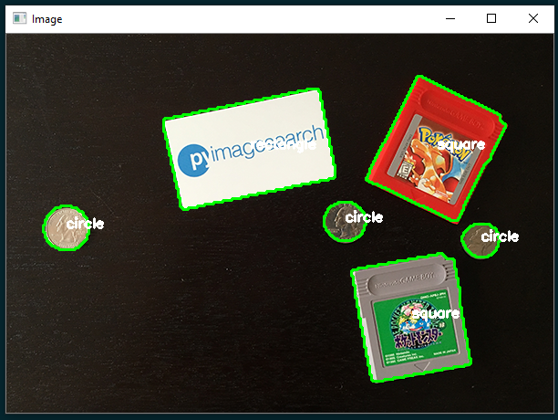

# Draw Size

Basic example of real time size estimation from camera with with OpenCV

The first-left object width is the reference for measurement

  * MIT License
  * Required Python 3.6+


# References

Base examples from pyimagesearch:

* https://www.pyimagesearch.com/2016/03/28/measuring-size-of-objects-in-an-image-with-opencv/
* https://www.pyimagesearch.com/2016/02/08/opencv-shape-detection/

# How to use
after install...

## Example
```bash
python3 draw_size.py --camera 0 --width 2.0 --float 2
```
arguments:
* camera: source id (default webcam is 0) - optional
* width: width in centimeters of the first-left object (for reference) - required
* float: floating point precision

press **q** to exit

## For study and sharing purposes I added a basic shape detection algorithm



## Example
```bash
python3 shape_detector.py --image images\example_01.png
```
arguments:
* image: the image path

# Install

*if **pip3** command not working use [**pip**](https://www.scaler.com/topics/what-is-pip-in-python/) instead

**if something not work, try to reboot the terminal. :)

## MacOS
```bash
xcode-select --install
```
```bash
/usr/bin/ruby -e "$(curl -fsSL https://raw.githubusercontent.com/Homebrew/install/master/install)"
```
```bash
brew install git cmake python3
```
```bash
git clone https://github.com/alexandremendoncaalvaro/draw-size.git
cd draw-size
```
```bash
pip3 install virtualenv
```
```bash
virtualenv cv
source cv/bin/activate
```
```bash
pip3 install -r requirements.txt
```
## Ubuntu
```bash
sudo apt update && sudo apt upgrade
```
```bash
sudo apt-get install git build-essential cmake python3 python3-pip python3-dev python3-setuptools
```
```bash
git clone https://github.com/alexandremendoncaalvaro/draw-size.git &&
cd draw-size
```
```bash
pip3 install virtualenv
```
```bash
virtualenv cv && source cv/bin/activate
```
```bash
pip3 install -r requirements.txt
```
## Windows
```cmd
@"%SystemRoot%\System32\WindowsPowerShell\v1.0\powershell.exe" -NoProfile -InputFormat None -ExecutionPolicy Bypass -Command "iex ((New-Object System.Net.WebClient).DownloadString('https://chocolatey.org/install.ps1'))" && SET "PATH=%PATH%;%ALLUSERSPROFILE%\chocolatey\bin"
```
* Install Visual Studio **with Visual C++ Build Tools 2015**

  https://visualstudio.microsoft.com

```cmd
choco install git cmake python3 -Y
```
```cmd
git clone https://github.com/alexandremendoncaalvaro/draw-size.git &&
cd draw-size
```
```cmd
pip3 install virtualenv
```
```cmd
virtualenv cv &&
cv\Scripts\activate
```
```cmd
pip3 install -r requirements.txt
```

## Virtual Enviroments
*It's optional, but I strongly recomend you to know about (and use) [Virtual Enviroments](https://www.geeksforgeeks.org/python-virtual-environment/)

The **virtualenv** lib is a tool to create isolated Python environments. virtualenv creates a folder which contains all the necessary executables to use the packages that a Python project would need.

### pip command
```bash
pip3 install virtualenv
```
You can create a virtualenv using the following command (*choose a name, I used cv):
```bash
virtualenv cv
```
Activate it:
### MacOS & Ubuntu
```bash
source cv/bin/activate
```
### Windows
```cmd
cv\Scripts\activate
```

Now **ALL** pip libraries will be installed isolated inside the environment. It'll look like this:

**(cv)$ pip3 install ...**

If you want to deactivate:

**(cv)$ deactivate**

Command:
```bash
deactivate
```
